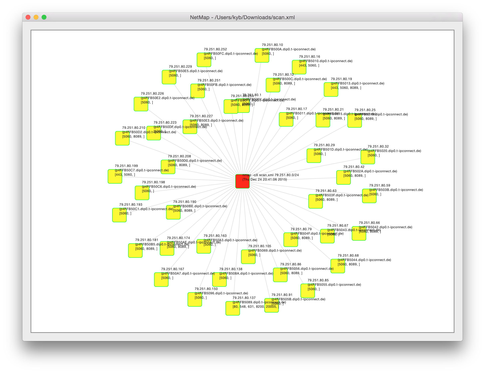

# netmap
Nmap XML Output Visualizer

dependencies: Carthage

run 

    carthage bootstrap 

after clone

to generate an XML file do this:

    nmap -oX test.xml 10.0.0.0/24

glamour shot:
	

(c) Jaroslaw Leon Szpilewski

License: Affero GPL 3
